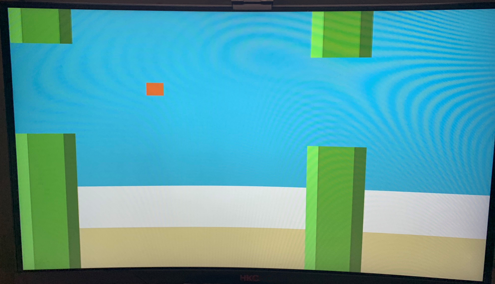

# VHDL-Flappy bird
## A flappy bird game on Nexys DDR 4 FPGA board

- By tapping the button, player can control the bird to jump over randomly generized obstacles.
- Current and the highest mark can also be stored and displayed.
 

Fig.01 -- Gaming (Please ignore the crude gaming scene)
 

 
Fig.02 -- Game over scene (Implemented through registers)

_Feel free to contact me at [barryzooou@gmail.com](https://mail.google.com)._
